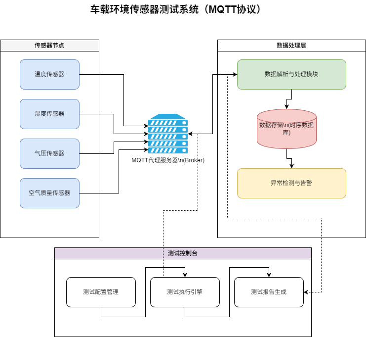

 

# 车载环境传感器测试系统接口定义说明书

**文档编号**：
**项目名称**：基于MQTT的车载环境传感器测试系统
**密级**：内部公开
**编写日期**：
**状态**：正式发布

---

## 1. 范围与概述

### 1.1 文档目的
本文档旨在定义车载传感器测试系统中各子系统（传感器终端、后端服务、前端应用）之间的数据交互接口。所有开发人员（或开发阶段）必须严格遵守本规范，以确保系统的兼容性、可维护性和扩展性。

### 1.2 系统边界
系统由三部分组成：
1.  **终端层**：ESP32硬件或Python模拟器，作为数据生产者。
2.  **服务层**：Python后端服务，作为数据处理与存储中心。
3.  **应用层**：Vue前端网页，作为数据消费者与控制台。

---

## 2. 通信协议公共约定

### 2.1 字符编码
*   所有HTTP响应体及MQTT Payload均采用 **UTF-8** 编码。
*   数据交换格式统一采用 **JSON (JavaScript Object Notation)**。

### 2.2 时间格式约定
*   **传输格式**：Unix 时间戳（秒级，Integer类型）。例如：`1716633600`。
*   **展示格式**：前端展示及报表导出采用 `YYYY-MM-DD HH:mm:ss`。

### 2.3 状态码定义 (HTTP)
*   `200 OK`：请求成功。
*   `400 Bad Request`：参数错误（如缺少必填项）。
*   `500 Internal Server Error`：服务器内部错误。

---

## 3. MQTT 数据接口规范

### 3.1 连接参数

| 参数          | 值                                 | 说明                                  |
| :------------ | :--------------------------------- | :------------------------------------ |
| Broker地址    | `broker.emqx.io` (开发)            | 支持替换为私有IP                      |
| 端口          | `1883`                             | TCP 非加密端口                        |
| ClientID      | `client_{device_type}_{device_id}` | 例如：`client_sim_01`，需保证全局唯一 |
| Clean Session | `true`                             | 建立新会话，清除旧状态                |
| Keep Alive    | `60s`                              | 心跳间隔                              |

### 3.2 Topic 定义

| 方向     | Topic 模板                             | QoS   | 描述                           |
| :------- | :------------------------------------- | :---- | :----------------------------- |
| **上报** | `vehicle/{device_id}/sensors/realtime` | **1** | **核心接口**：传感器实时数据流 |
| **上报** | `vehicle/{device_id}/status/heartbeat` | 0     | 设备在线心跳（可选实现）       |
| **下发** | `vehicle/{device_id}/command/config`   | 1     | 远程配置指令（如修改采样频率） |

### 3.3 消息负载 详细定义

#### 3.3.1 上行数据包
**场景**：终端向服务器发送环境数据。

**JSON 结构定义**：
```json
{
  "device_id": "ESP32_DEV_01",
  "timestamp": 1716633600,
  "data": {
    "temperature": 28.5,
    "humidity": 65.2,
    "pressure": 101.3,
    "acc_x": 0.02,
    "acc_y": -0.01,
    "acc_z": 9.8
  },
  "status": {
    "rssi": -45,
    "battery": 98
  }
}
```

**字段约束表**：

| 一级字段    | 二级字段      | 类型    | 必填 | 说明         | 校验规则                  |
| :---------- | :------------ | :------ | :--- | :----------- | :------------------------ |
| `device_id` | -             | String  | 是   | 设备唯一标识 | 长度<=32                  |
| `timestamp` | -             | Integer | 是   | 采集时间     | 必须在当前时间前后5分钟内 |
| `data`      | -             | Object  | 是   | 传感器数据体 | -                         |
| -           | `temperature` | Float   | 是   | 温度 (℃)     | 范围: -40.0 ~ 125.0       |
| -           | `humidity`    | Float   | 是   | 湿度 (%)     | 范围: 0.0 ~ 100.0         |
| -           | `pressure`    | Float   | 否   | 气压         | -                         |
| `status`    | -             | Object  | 否   | 设备状态     | -                         |
| -           | `rssi`        | Integer | 否   | 信号强度     | -                         |

---

## 4. HTTP RESTful API 接口规范

**Base URL**: `http://127.0.0.1:8000`

### 4.1 统一响应结构
为了规范前端处理，后端应封装统一的响应格式。

```json
{
  "code": 200,
  "message": "success",
  "data": { ... }
}
```
*(注：FastAPI开发中若暂未封装中间件，直接返回Resource对象亦可，但文档中应定义此标准)*

### 4.2 接口详细定义

#### API 01：获取实时监控数据
用于前端仪表盘组件的轮询刷新。

*   **Endpoint**: `GET /api/v1/sensors/realtime`
*   **Query Parameters**:
    | 参数名      | 类型   | 必填 | 默认值 | 说明                         |
    | :---------- | :----- | :--- | :----- | :--------------------------- |
    | `device_id` | String | 否   | -      | 不传则返回第一个在线设备数据 |
*   **Response JSON**:
    ```json
    {
        "id": 1001,
        "device_id": "ESP32_SIM_01",
        "temperature": 27.5,
        "humidity": 60.0,
        "is_abnormal": false,
        "error_msg": null,
        "create_time": "2024-05-25T15:00:00"
    }
    ```

#### API 02：查询历史数据列表
用于历史曲线图和表格展示。

*   **Endpoint**: `GET /api/v1/sensors/history`
*   **Query Parameters**:
    | 参数名       | 类型    | 必填 | 默认值 | 说明                                      |
    | :----------- | :------ | :--- | :----- | :---------------------------------------- |
    | `page`       | Integer | 否   | 1      | 当前页码                                  |
    | `size`       | Integer | 否   | 20     | 每页条数                                  |
    | `start_time` | String  | 否   | -      | 起始时间 (YYYY-MM-DD HH:mm:ss)            |
    | `end_time`   | String  | 否   | -      | 结束时间                                  |
    | `filter`     | String  | 否   | all    | 筛选条件：`all`(全部), `abnormal`(仅异常) |
*   **Response JSON**:
    ```json
    {
        "total": 150,
        "page": 1,
        "size": 20,
        "items": [
            {
                "id": 1001,
                "temperature": 105.5,
                "humidity": 55.0,
                "is_abnormal": true,
                "error_msg": "温度超限: 105.5℃",
                "create_time": "2024-05-25T14:28:00"
            }
            // ... more items
        ]
    }
    ```

#### API 03：获取测试统计概览
用于首页数据卡片展示。

*   **Endpoint**: `GET /api/v1/test/statistics`
*   **Response JSON**:
    ```json
    {
        "total_tests": 1250,
        "pass_count": 1230,
        "fail_count": 20,
        "pass_rate": 98.4,
        "last_update": "2024-05-25T15:05:00"
    }
    ```

---

## 5. 数据库字典

**表名**：`sensor_data` (传感器数据主表)

| 字段名        | 数据类型 | 长度 | 允许空 | 主键 | 说明                      |
| :------------ | :------- | :--- | :----- | :--- | :------------------------ |
| `id`          | BIGINT   | -    | 否     | 是   | 自增主键                  |
| `device_id`   | VARCHAR  | 64   | 否     | -    | 设备编号，索引            |
| `temperature` | FLOAT    | -    | 否     | -    | 温度值                    |
| `humidity`    | FLOAT    | -    | 否     | -    | 湿度值                    |
| `is_abnormal` | BOOLEAN  | -    | 否     | -    | 测试结果：0正常/1异常     |
| `error_msg`   | VARCHAR  | 255  | 是     | -    | 异常原因描述              |
| `raw_data`    | TEXT     | -    | 是     | -    | 原始JSON字符串备份 (可选) |
| `create_time` | DATETIME | -    | 否     | -    | 数据入库时间，索引        |

---

## 6. 自动化测试逻辑规范

本章节定义后端“测试引擎”的校验规则。当数据入库前，必须经过以下流程判定：

### 6.1 校验规则表

| 规则ID | 规则名称   | 校验对象      | 合法范围                      | 错误代码         | 错误描述模板       |
| :----- | :--------- | :------------ | :---------------------------- | :--------------- | :----------------- |
| R001   | 温度范围   | `temperature` | `-40.0 <= T <= 85.0`          | `TEMP_RANGE_ERR` | 温度超限: {value}℃ |
| R002   | 湿度范围   | `humidity`    | `0.0 <= H <= 100.0`           | `HUM_RANGE_ERR`  | 湿度非法: {value}% |
| R003   | 数据完整性 | JSON字段      | 必含`temperature`, `humidity` | `DATA_LOST_ERR`  | 缺少必填字段       |
| R004   | 时间偏移   | `timestamp`   | 与服务器时间差 < 300s         | `TIME_SYNC_ERR`  | 设备时间不同步     |

### 6.2 伪代码逻辑

```python
def validate_data(payload):
    errors = []
    temp = payload['data']['temperature']
    hum = payload['data']['humidity']

    # Rule R001
    if temp < -40 or temp > 85:
        errors.append(f"温度超限: {temp}℃")

    # Rule R002
    if hum < 0 or hum > 100:
        errors.append(f"湿度非法: {hum}%")

    # Rule R003 (示例)
    if 'temperature' not in payload['data']:
        errors.append("缺少温度字段")

    is_abnormal = len(errors) > 0
    return is_abnormal, "; ".join(errors)
```

---

## 7. 附录：错误码速查表

| 错误码 | HTTP Status | 说明           | 前端处理建议           |
| :----- | :---------- | :------------- | :--------------------- |
| 200    | 200         | 成功           | 正常解析 data 字段     |
| 40001  | 400         | 参数缺失       | 弹窗提示“请求参数错误” |
| 50001  | 500         | 数据库连接失败 | 弹窗提示“服务暂不可用” |

---

### 使用建议

1.  **论文直接引用**：将此文档内容直接放入毕业论文的 **“第X章 系统详细设计” -> “接口设计”** 章节。
2.  **开发对照**：后续代码编写中，如果忘记字段名，直接查阅 **“字段约束表”**。
3.  **答辩演示**：答辩时，可以将这份文档打印出来作为附录材料，展示你开发的规范性和严谨性。